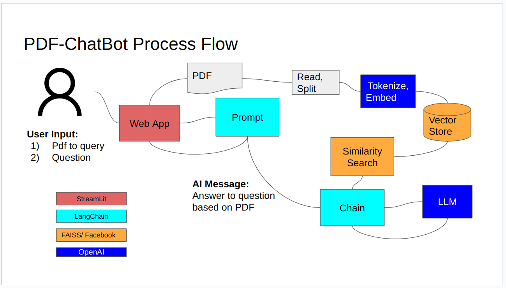
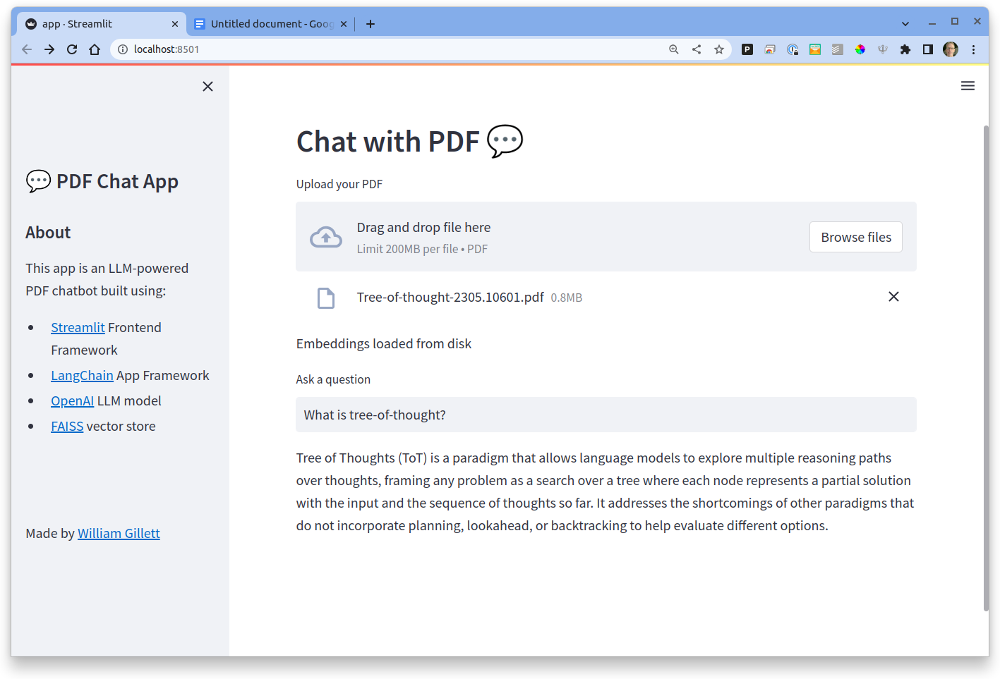

# Chat-LangChain-Faiss-Streamlit-py

ChatGPT-like app for querying pdf files.  User can upload a pdf file and the app will allow for queries against it.  Built on Langchain, OpenAI, FAISS, Streamlit. 
Inspired by YouTube Video from [Prompt Engineer](https://youtube.com/@engineerprompt).


## Installation
### Prerequisites:
- Python 3.8 and above
- [OpenAI API key](https://platform.openai.com/account/api-keys)

#### 1) Clone repo

#### 2) Create virtual env (e.g. [venv](https://docs.python.org/3/library/venv.html))

#### 3) Install required python packages via pip
```bash
pip install -r requirements.txt
```
#### 4) Create .env file from example and copy over API key
```bash
cp .env.example .env
```
## Usage
#### Launch app from terminal
```bash
streamlit run app.py
```
#### Open App in browser & follow prompts
```url
http://localhost:8501/
``` 
####
## Screenshots


## Contributing

Pull requests are welcome. For major changes, please open an issue first
to discuss what you would like to change.

## License

[MIT](https://choosealicense.com/licenses/mit/)